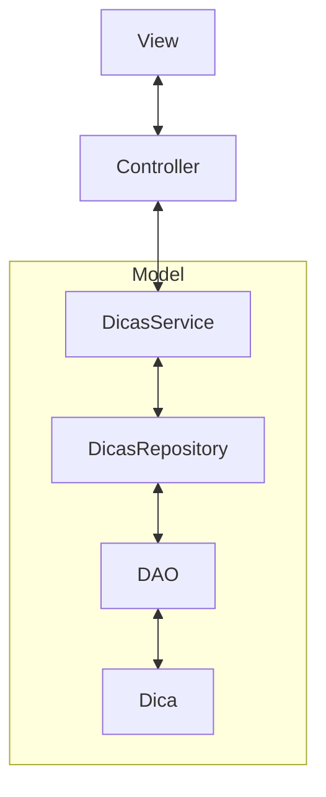

# Tutorial MVC em Java

## Introdução

O padrão MVC é um dos padrões de projeto mais comuns em desenvolvimento de aplicativos. Ele é usado para organizar o código em uma estrutura mais limpa e facilitar a manutenção do código.

## O que é MVC?

O MVC é um acrônimo para Model-View-Controller. É um padrão de arquitetura que separa a lógica de negócios da apresentação da interface do usuário.

- **Model**: Responsável pela lógica de negócios da aplicação. Ele mantém os dados e define as regras de negócio.
- **View**: É a parte responsável pela apresentação da interface do usuário. Ela recebe os dados do model e os apresenta ao usuário.
- **Controller**: É o intermediário entre o model e a view. Ele recebe as ações do usuário, atualiza o model e atualiza a view.

## Exemplo de Implementação

Vamos criar um exemplo simples de uma aplicação que usa o padrão MVC. Vamos criar uma aplicação de cadastro de usuários.

### Model

O model é responsável pela lógica de negócios da aplicação. No nosso caso, o model terá as classes `Dica`, `DicasRepository` e `DicasService`. O `DicasService` será responsável pelas regras de negócio da aplicação.


#### Services

As classes services são responsáveis pela implementação das regras de negócio da aplicação. No nosso caso, o `DicasService` terá os métodos `criarDica()`, `atualizarDica()`, `deletarDica()` que implementam as regras de negócio da aplicação, como persistir os dados no banco de dados, validar os dados e lidar com possíveis exceções.

### View

A view é responsável pela apresentação da interface do usuário. No nosso caso, a view será uma interface com os métodos `criarDica()`, `atualizarDica()`, `deletarDica()` para a criação, atualização e exclusão de uma dica.

### Controller

O controller é responsável por receber as ações do usuário e atualizar o model e a view. No nosso caso, o controller terá a classe `DicasController` com os métodos `criarDica()`, `atualizarDica()`, `deletarDica()` que receberão os dados do formulário e atualizarão o model e a view.

### Controller

O controller é responsável por receber as ações do usuário e atualizar o model e a view. No nosso caso, o controller terá a classe `DicasController` com os métodos `criarDica()`, `atualizarDica()`, `deletarDica()` que receberão os dados do formulário, atualizarão o `DicasService` e atualizarão a view.

O padrão MVC possui algumas vantagens, destacando a seguinte características:

- **Dependencia única entre cada camada**: Cada camada (model, view e controller) depende apenas da camada adjacente. Isso significa que cada camada é independente das demais e pode ser testada e reutilizada facilmente.

- **Baixo acoplamento**: Cada camada não depende diretamente das demais, o que reduz o acoplamento entre as camadas. Isso facilita a manutenção do código, pois qualquer alteração em uma camada não afeta as demais.

- **Facilidade de manutenção e testes**: Como cada camada é independente, é mais fácil testar cada uma delas isoladamente. Isso permite identificar e corrigir problemas de forma mais eficiente. Além disso, a separação das responsabilidades torna o código mais legível e fácil de entender.


# MVC - Model-View-Controller



# Tutorial

## Passo 1: Criar o projeto
1. Crie um novo projeto Java no NetBeans/VSCode/IntelliJ.

> Importante: Certifique-se de que o projeto esteja configurado para usar o Java 17 ou superior e não utilize gerenciadores de dependências como Maven ou Gradle.

2. Adicione a biblioteca do MySQL Connector/J ao projeto.

> Importante: Baixe o arquivo `mysql-connector-j-9.6.0.jar` e adicione-o ao diretório `libs` do projeto.

3. Crie a estrutura de pastas do projeto.

```
.
├── README.md
├── src
│   └── dicasdev
│       ├── Main.java
│       ├── controller
│       ├── libs
│       │   └── mysql-connector-j-9.6.0.jar
│       ├── model
│       │   ├── dao
│       │   ├── domain
│       │   ├── factories
│       │   ├── repositories
│       │   │   └── impl
│       │   └── services
│       └── view
└── test
```
## Criar as classes necessárias para a camada de modelo

1. Crie a classe `Dica` na pasta `model/domain`.

2. Crie a interface `IDicasRepository` na pasta `model/repositories`.

3. Crie a classe `EmMemoriaDicasRepository` na pasta `model/repositories/impl`.

4. Crie a classe `MySqlDicasRepository` na pasta `model/repositories/impl`.

5. Crie a classe `DicasService` na pasta `model/services`.

6. Crie a classe `ConexaoFactory` na pasta `model/factories`.

7. Configure a conexão com o banco de dados.

```java
// Inclua o código na classe `factories/ConexaoFactory.java`
public class ConexaoFactory {
    private static final String URL = "jdbc:mysql://localhost:3306/dicasdev";
    private static final String USER = "root";
    private static final String PASSWORD = "";
    
    public static Connection getConnection() throws SQLException {
        return DriverManager.getConnection(URL, USER, PASSWORD);
    }
}
```

## Criar a tabela no banco de dados

Utilizando o MySQL Workbench ou qualquer outro cliente MySQL:

```sql
-- Crie a tabela no banco de dados
CREATE DATABASE IF NOT EXISTS dicasdev;
USE dicasdev;
CREATE TABLE dicas (
    id INT AUTO_INCREMENT PRIMARY KEY,
    titulo VARCHAR(255) NOT NULL,
    descricao TEXT NOT NULL,
    data_criacao TIMESTAMP DEFAULT CURRENT_TIMESTAMP
);
```

### Crie a classe de domínio Dica 

A classe de domínio representa o objeto de negócio que será manipulado pela aplicação.

```java
package dicasdev.model.domain;

public class Dica {
    public Integer id;
    public String titulo;
    public String descricao;
    @Override
    public String toString() {
        return "Dica [id=" + id + ", titulo='" + titulo + "', descricao='" + descricao + "']";
    }
}
```

## Criando a interface genérica do repositório

Utilizando a interface genérica do repositório:
- Crie a interface `IDicasRepository` na pasta `model/repositories`.

> Iremos utilizar a programação orientada a interface, ou seja, vamos criar uma interface genérica para o repositório e depois implementá-la. Com esta abordagem, podemos trocar facilmente a implementação do repositório, por exemplo, de memória para banco de dados.


```java
// Inclua o código na classe `repositories/IDicasRepository.java`
package dicasdev.model.repositories;

import java.util.List;

import dicasdev.model.domain.Dica;

public interface IDicasRepository {
    Dica criar(Dica dica);
    void apagar(Integer id);
    List<Dica> buscarTodas();
    Dica buscarPorId(Integer id);
    Dica atualizar(Dica dica);
}
```

# Implementação de camada de servços

[Implementação de camada de servços](docs/implementacao-de-camada-de-servicos.md)


